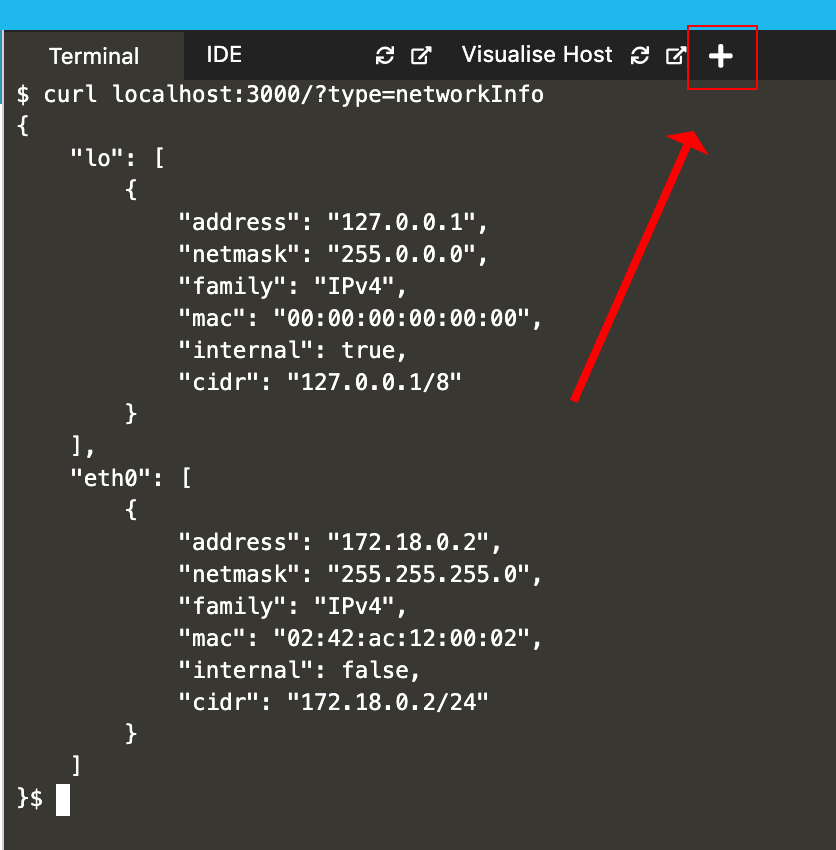
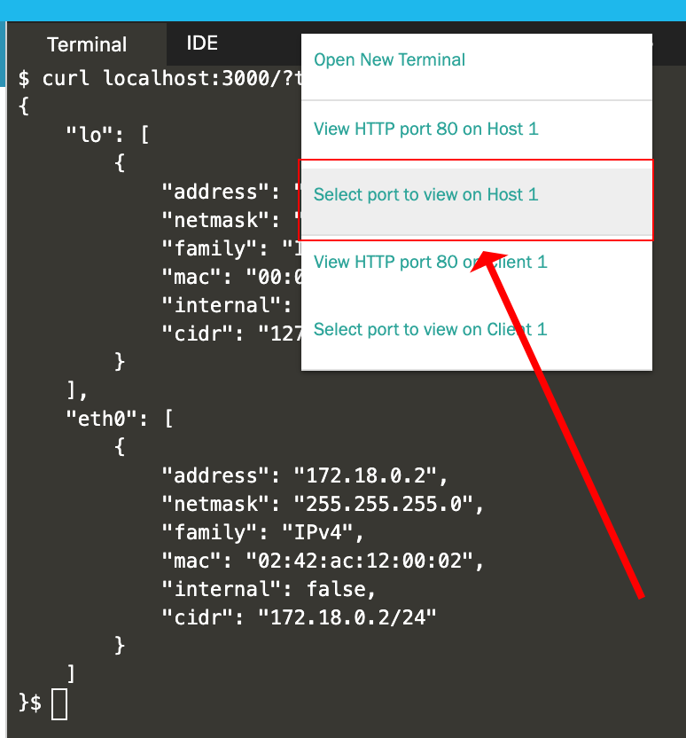
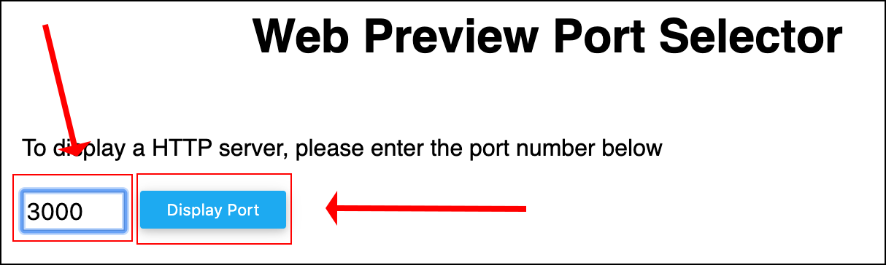
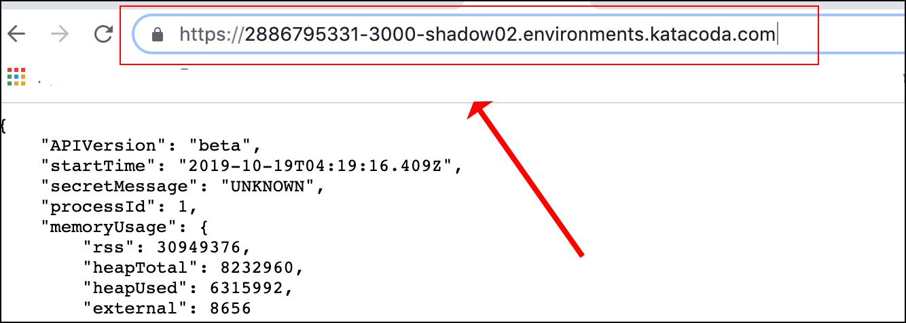

# pinger
A simple Node.js app that returns information about the runtime environment.

Go [here](./app/readme.md) to read the command line reference.

## Running `pinger` on a local machine.
The following steps describe how to run `pinger` on a standalone computer or virtual machine.
Please be advised that the machine needs to have Node.js and `curl` installed.

`https://katacoda.com/courses/kubernetes/playground`

`git clone https://github.com/reselbob/pinger.git`

`cd pinger/app`

**Step 1:** Make sure that Node.js is running your computer or VM (virtual machine). Run
the following command in a terminal window.

`node -v`

You'll get output similar to the following:

`v8.11.3`

(Version number may vary according to your machine.)

If Node.js in not installed, you'll get an error. In that case, you can find the instructions
for downloading and installing Node.js [here](https://nodejs.org/en/download/).

**Step 2:** Clone this repository to the local machine or VM.

`git clone https://github.com/reselbob/pinger.git`

**Step 3:** Navigate into the directory that has the `pinger` source code.

`cd pinger/app`

**Step 4:** Install the application's dependencies packages.

`npm install`

**Step 5:** Invoke the application.

`node server.js`

**Step 6:** Call the application for output using `curl`. In a new terminal
window execute the following command.

`curl localhost:3000`

WHERE `3000` is the default port.

You can alter the runtime port of the app by setting the environment variable, `PINGER_PORT` to the port number you want to use.

You get output similar to the following:

```$json
{
    "APIVersion": "v2",
    "startTime": "2018-10-23T22:54:27.516Z",
    "interfaces": [
        {
            "ifname": "eth0",
            "ipaddress": "10.32.0.13"
        }
    ],
    "secretMessage": "Kube is Cool",
    "processId": 5,
    "requestHeaders": {
        "host": "xxx.241.xxx.171",
        "upgrade-insecure-requests": "1",
        "user-agent": "Mozilla/5.0 (Macintosh; Intel Mac OS X 10_13_6) AppleWebKit/537.36 (KHTML, like Gecko) Chrome/69.0.3497.100 Safari/537.36",
        "accept": "text/html,application/xhtml+xml,application/xml;q=0.9,image/webp,image/apng,*/*;q=0.8",
        "accept-encoding": "gzip, deflate",
        "accept-language": "en-US,en;q=0.9",
        "x-cloud-trace-context": "78f550b3bbf754251021bb4a582f8bf0/17461875170587409562",
        "via": "1.1 google",
        "x-forwarded-for": "xx.169.xxx.145, xxx.241.xxx.171",
        "x-forwarded-proto": "http",
        "connection": "Keep-Alive"
    },
    "currentTime": "2018-10-24T15:06:49.046Z",
    "requestUrl": "/"
}
```

## Building and running `pinger` as a Docker container on Katacoda


**Step 1:** Go to the Ubuntu Playground on Katacoda

`https://katacoda.com/courses/ubuntu/playground`

**Step 2:** Clone the project source from GitHub

`git clone https://github.com/reselbob/pinger.git`

**Step 3:** Navigate to the application source code directory

`cd pinger/app/`

**Step 4:** Build the container image.

(You must be connected to the internet for this step to work.)

`docker build -t pinger:beta .`

**Step 5:** Create the container get it running

```text
docker run -d --name pinger -p 3000:3000  -e CURRENT_VERSION=beta pinger:beta
```

You'll get the container id as output, similar to this:

`6a619a913e0c25df5adccd5e11de899a97405c43de9cfb1a0945ee81148068ae`
Confirm the container is running:

`docker ps -a | grep pinger`

You'll get output similar to the following:

```text
6a619a913e0c        pinger:beta         "node server.js"    About a minute ago   Up About a minute   0.0.0.0:3000->3000/tcp   pinger```
```
**Step 6:** Call the application for output using `curl`. 

`curl localhost:3000/?type=networkInfo`

You'll get output similar to the following:

```json
{
    "lo": [
        {
            "address": "127.0.0.1",
            "netmask": "255.0.0.0",
            "family": "IPv4",
            "mac": "00:00:00:00:00:00",
            "internal": true,
            "cidr": "127.0.0.1/8"
        }
    ],
    "eth0": [
        {
            "address": "172.18.0.2",
            "netmask": "255.255.255.0",
            "family": "IPv4",
            "mac": "02:42:ac:12:00:02",
            "internal": false,
            "cidr": "172.18.0.2/24"
        }
    ]
}
```
**Step 7:** Let's open `pinger` as a web page. Click the (+) sign on the right of the
Katacoda menu page/



**Step 8:** click `Select port to view on Host 1`



**Step 8:** Enter the port number `3000` in the textbox on the 
web page. Then click the button, `Display Port`



The web page will appear. It's calling back to the running instance of
`pinger`. 

**Step 9:** If you need to work with `pinger` by calling into the Katacoda server,
copy the URL in your browser's address bar and save it in a text file.



**Congratulations!** You've completed the exercise.
